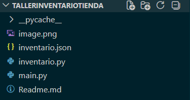

# Gestionador de Inventarios para Tiendas
### Nombre del repositorio 🚀: _TallerInventarioTienda_ 

#### ✅ Descripcion del proyecto:
Aplicacion de consola desarrollado en Python para gestionar los inventarios de tiendas pequeñas, este programa es capaz de :
- Agregar productos
- Listar los productos
- Actualizar la cantidad de productos
- Eliminar productos
- Calcular el valor total del inventario

## 👾 *Como ejecutar el proyecto*
1. Crear un directorio especifico para el proyecto
2. Clonar el repositorio en el direcotrio especificado:
```bash
git clone https://github.com/Anderson-Oloroso/TallerInventarioTienda.git
```
3. Abrir el proyecto
4. Ejecutar el archivo "main.py"

## 👾 *Archivos del proyecto*
Puede ser directamente la estructura o solo una imagen del visor de archivos



## 💻 *Tecnologías utilizadas*
- 🐍 Python
- 🐙 Git
- 🐱 GitHub

## 👤 _Creador_
#### *Nombre:* <u>Henrik Anderson Oloroso García</u>
##### *Fecha de creación:* <u>6 de marzo del 2026</u>